# GKE 3-Tier Platform

A subscription tracker — React SPA, Express API, Postgres — run as a
production-shaped platform on Google Kubernetes Engine: Istio service mesh
with STRICT mTLS, canary releases on both application tiers, everything
inside the cluster reconciled from Git, and a capacity number that comes
from a load test rather than a guess.

Live at **[gke-3tier.mhassankhokhar.site](https://gke-3tier.mhassankhokhar.site)**.
The application repo (this one) holds `web/`, `api/`, `terraform/` and the
load-test harness; every Kubernetes manifest lives in the separate
[`gke-3tier-gitops`](https://github.com/mhassaankhokhar/gke-3tier-gitops)
repo that Argo CD reads.

```
user
  │ https
  ▼
Cloudflare (DNS, TLS) ──▶ GCP Load Balancer ──▶ Istio ingress gateway
                                                       │  mTLS
                              ┌────────────────────────┴────────────────────────┐
                              │  GKE cluster                                    │
                              │                                                 │
                              │  web (nginx + React) ──mTLS──▶ api (Node/Express)│
                              │  spot pool, HPA 2-6            spot pool, HPA 2-6│
                              │                                   │        │    │
                              │                              mTLS │        │mTLS│
                              │                                   ▼        ▼    │
                              │                              Redis    Postgres  │
                              │                              (cache)  CloudNativePG
                              │                              stable pool, 2 instances
                              │                              Postgres: own TLS, outside the mesh
                              └─────────────────────────────────────────────────┘
```

## Architecture Deck

<details>
<summary><strong>11-slide walkthrough</strong> — architecture, infrastructure, the four pillars, and measured capacity. Click to expand, then use the <strong>Next →</strong> link under each slide.</summary>

> GitHub's README viewer doesn't run JavaScript, so this isn't a real slide player —
> each "Next" jumps to the next image further down this page rather than swapping one
> frame for another. It works, but it's a long scroll, not a deck. The source
> [`.pptx`](docs/deck/gke-3tier-full-deck.pptx) is in this repo if you'd rather flip
> through it in PowerPoint.

<a id="deck-1"></a>
<p align="center">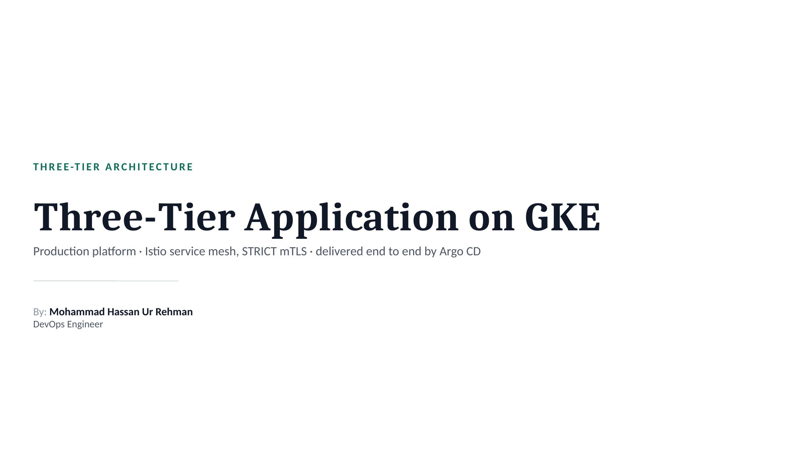</p>
<p align="center"><a href="#deck-2">Next →</a></p>

---

<a id="deck-2"></a>
<p align="center">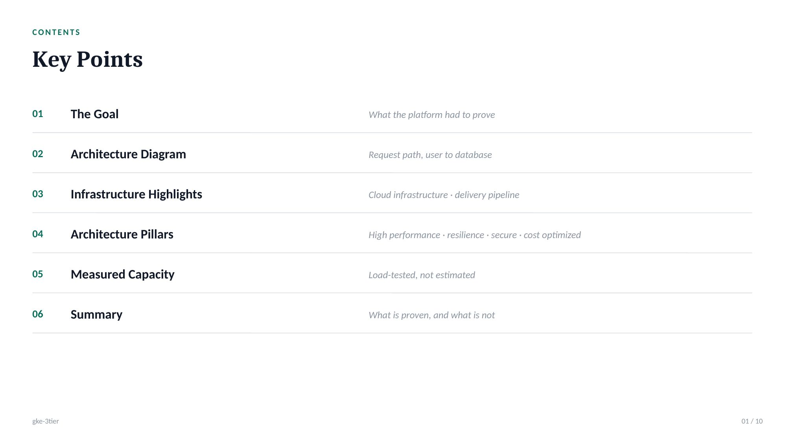</p>
<p align="center"><a href="#deck-1">← Prev</a>&nbsp;&nbsp;·&nbsp;&nbsp;<a href="#deck-3">Next →</a></p>

---

<a id="deck-3"></a>
<p align="center">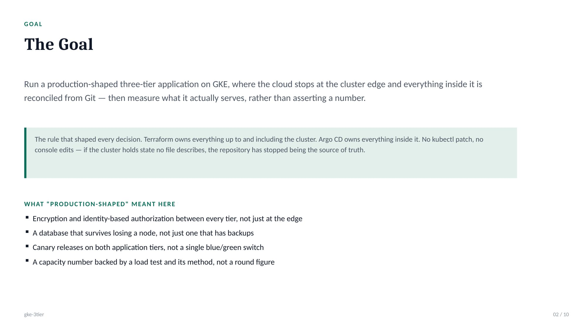</p>
<p align="center"><a href="#deck-2">← Prev</a>&nbsp;&nbsp;·&nbsp;&nbsp;<a href="#deck-4">Next →</a></p>

---

<a id="deck-4"></a>
<p align="center">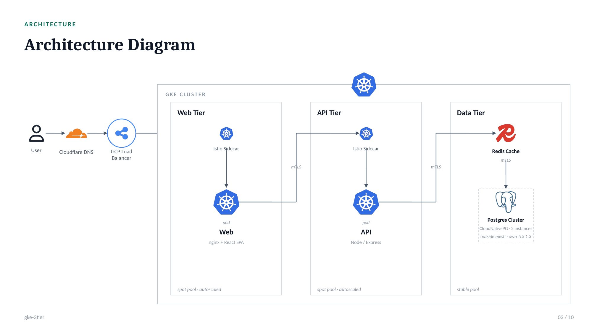</p>
<p align="center"><a href="#deck-3">← Prev</a>&nbsp;&nbsp;·&nbsp;&nbsp;<a href="#deck-5">Next →</a></p>

---

<a id="deck-5"></a>
<p align="center">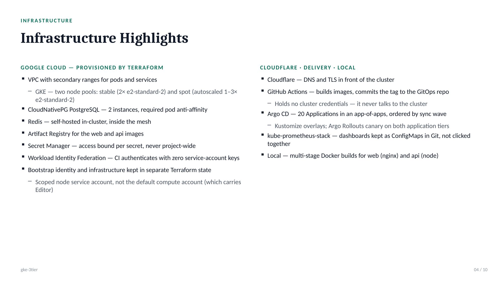</p>
<p align="center"><a href="#deck-4">← Prev</a>&nbsp;&nbsp;·&nbsp;&nbsp;<a href="#deck-6">Next →</a></p>

---

<a id="deck-6"></a>
<p align="center">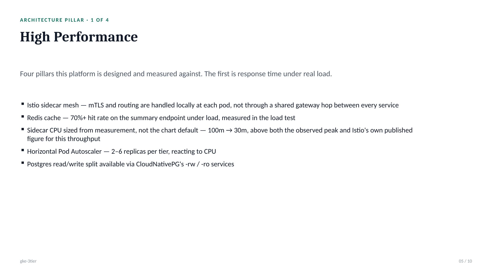</p>
<p align="center"><a href="#deck-5">← Prev</a>&nbsp;&nbsp;·&nbsp;&nbsp;<a href="#deck-7">Next →</a></p>

---

<a id="deck-7"></a>
<p align="center">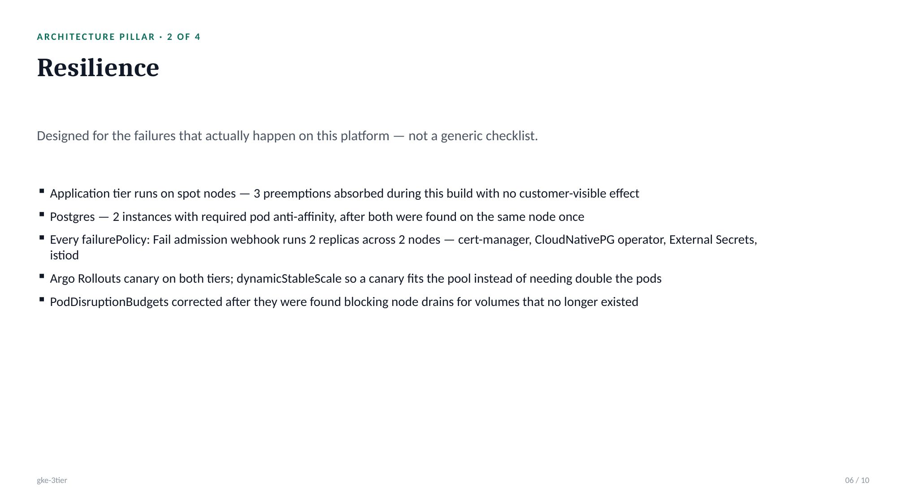</p>
<p align="center"><a href="#deck-6">← Prev</a>&nbsp;&nbsp;·&nbsp;&nbsp;<a href="#deck-8">Next →</a></p>

---

<a id="deck-8"></a>
<p align="center">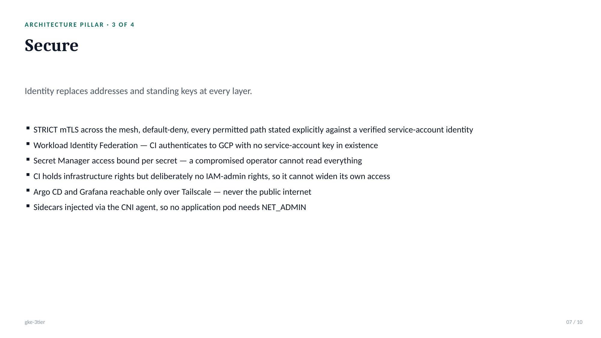</p>
<p align="center"><a href="#deck-7">← Prev</a>&nbsp;&nbsp;·&nbsp;&nbsp;<a href="#deck-9">Next →</a></p>

---

<a id="deck-9"></a>
<p align="center">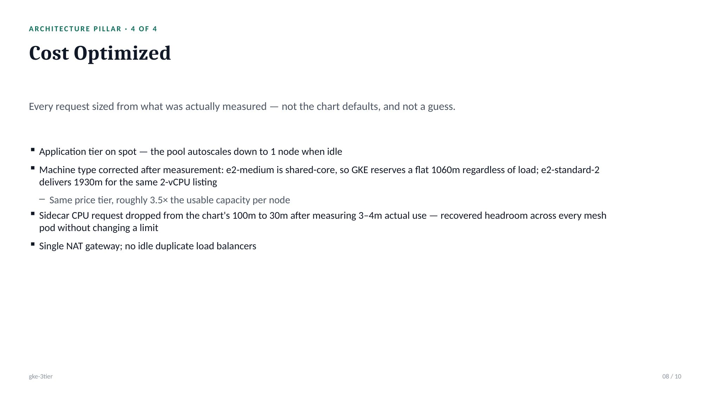</p>
<p align="center"><a href="#deck-8">← Prev</a>&nbsp;&nbsp;·&nbsp;&nbsp;<a href="#deck-10">Next →</a></p>

---

<a id="deck-10"></a>
<p align="center">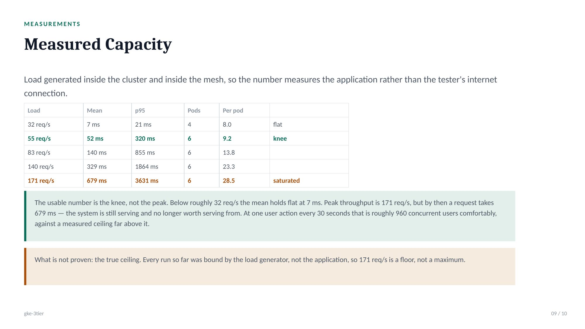</p>
<p align="center"><a href="#deck-9">← Prev</a>&nbsp;&nbsp;·&nbsp;&nbsp;<a href="#deck-11">Next →</a></p>

---

<a id="deck-11"></a>
<p align="center">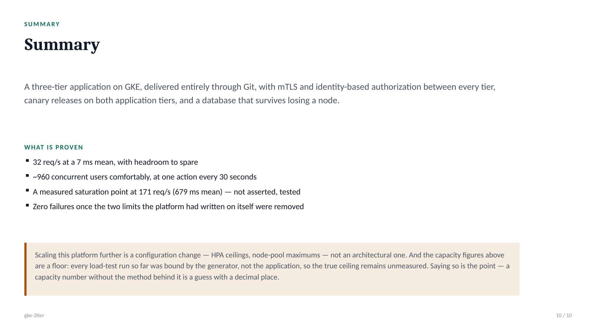</p>
<p align="center"><a href="#deck-10">← Prev</a>&nbsp;&nbsp;·&nbsp;&nbsp;<a href="#deck-1">↺ Back to start</a></p>

</details>

## Why this exists

`aws-3tier` runs this application on ECS Fargate with RDS. This repo runs the
same application on Kubernetes, with the database in-cluster and a service
mesh doing what a load balancer and a handful of AWS security-group rules did
there. Running one application two ways is the point — it shows which parts
are portable and which were really cloud-vendor features.

| | aws-3tier | gke-3tier |
|---|---|---|
| Compute | ECS Fargate | GKE — spot pool (app) + stable pool (data), both e2-standard-2 |
| Database | RDS PostgreSQL (managed) | CloudNativePG, 2 instances, required pod anti-affinity |
| Service-to-service | security groups | Istio mesh, STRICT mTLS, identity-based `AuthorizationPolicy` |
| Releases | — | Argo Rollouts canary, both tiers |
| Registry | ECR | Artifact Registry |
| CI/CD auth | GitHub OIDC → IAM role | GitHub OIDC → Workload Identity Federation |
| Delivery | — | GitOps: Argo CD reconciles [`gke-3tier-gitops`](https://github.com/mhassaankhokhar/gke-3tier-gitops) |

## What's actually running

Everything below is measured or read from the live cluster, not aspirational —
see the [architecture deck](#architecture-deck) for the numbers behind each
line.

- **Mesh.** Istio sidecars on every application pod, `PeerAuthentication`
  STRICT, and a namespace-wide `deny-all` `AuthorizationPolicy` with each
  permitted call stated explicitly against a service-account principal —
  `web → api` on five HTTP methods, `api → redis`, gateway `→ web`. Postgres
  is deliberately outside the mesh; CloudNativePG runs its own CA and TLS 1.3,
  and a second mTLS layer on top of that adds a failure mode, not security.
- **Delivery.** GitHub Actions (`build.yml`) builds the `web`/`api` images and
  commits the new tag to the GitOps repo — it holds no cluster credentials and
  never talks to the cluster. Argo CD owns everything from there: ~20
  Applications in an app-of-apps, ordered by sync wave, including Argo CD
  managing its own Helm release.
- **Releases.** Argo Rollouts canary on both `web` and `api`, traffic split by
  Istio `VirtualService` weights. `dynamicStableScale` is on for this node
  pool: without it a canary needs the pod count doubled to run old and new at
  once, which this pool cannot fit.
- **Autoscaling.** HPA at 2-6 replicas per tier on CPU. The spot pool
  autoscales 1-3 nodes; the stable pool (Postgres, Redis) is fixed at 2.
- **Monitoring.** kube-prometheus-stack, dashboards checked into
  `manifests/monitoring/dashboards/` in the GitOps repo as ConfigMaps rather
  than built by hand in the Grafana UI. Grafana and Argo CD are reachable only
  over Tailscale — neither is exposed to the public internet.
- **Capacity.** Load-tested inside the cluster and inside the mesh (an
  external run mostly measures the tester's own internet connection). Mean
  latency holds flat at ~7 ms up to ~32 req/s; past that the curve bends. Full
  method and numbers: [`docs/deck`](#architecture-deck) and
  [`loadtest/`](loadtest/).

## Storage, and why most of it is now boring

GKE's default `pd-balanced` StorageClass is **ReadWriteOnce** — a volume
attaches to one node at a time. Postgres and Prometheus each get their own PVC
on `standard-rwo`; CloudNativePG replicates at the database layer rather than
sharing a volume, so RWO is the right answer and nothing here needs to be
clever about it.

**Longhorn is deployed and fully wired — `createDefaultDiskLabeledNodes`,
the GKE COS node agent for `iscsiadm`, an RWX StorageClass — and currently
holds zero volumes.** It was built for a shared-uploads feature the earlier
version of this app had; the app is a subscription tracker now, and nothing
in it needs `ReadWriteMany`. Rather than rip it out, it stayed as a real
finding: the two-layer placement problem (storage plane vs. client plane
across a spot/stable split), the COS iSCSI gap, and — once it turned out
Longhorn was writing a PodDisruptionBudget per node with nothing to protect,
blocking every node drain in the cluster — the
[`kubernetesClusterAutoscalerEnabled`](https://github.com/mhassaankhokhar/gke-3tier-gitops/blob/main/argocd/apps/04-longhorn.yaml)
fix that let it stop. The capability is there the day an RWX workload
actually shows up. Calling it "used" when it is not would be the kind of
claim this project tries not to make.

Keeping it wired has a real, ongoing price worth naming: Longhorn needs
`iscsiadm` and the `iscsi_tcp` module on the host, which no GKE node image
provides — Longhorn's docs recommend Ubuntu on GKE "since it contains
open-iscsi already", but a GKE Ubuntu 24.04 node does not. The requirement is
met by Longhorn's GKE COS node agent, a privileged DaemonSet that loads the
module and runs `iscsid` in a container, on every node, whether or not
anything ever mounts an RWX volume. A managed RWX service would not have
needed that daemon at all.

## Layout

```
terraform/
  bootstrap/             identity only — applied once, by hand, own state
  envs/dev/              network, cluster, registry, seed — applied by CI, own state
                         one directory per environment, each with its own state;
                         not CLI workspaces, which share a backend and credentials
  modules/
    network/             VPC, private subnets, Cloud NAT
    gke/                 cluster + two node pools (spot, stable), Workload Identity
    artifact-registry/   container images
    iam/                 scoped service accounts
    workload-identity/   GitHub OIDC → GCP
    cluster-seed/        External Secrets Operator, applied before Argo CD can
                         read the GitOps repo it needs ESO to fetch a key for
    argocd/              Argo CD's own Helm release
web/                     React SPA, built with Vite, served by nginx
api/                     Express API — Postgres via CloudNativePG, Redis cache
loadtest/                k6 load-test scenario and Job manifest
docs/                    decisions worth writing down, and the deck under docs/deck/
.github/workflows/
  build.yml              builds web/api images, commits the tag to the GitOps repo
  terraform.yml          plan on PR, apply on merge to main, scoped to terraform/**
  validate.yml           fmt/validate + a static security scan — runs credential-free,
                         so it is the one a fork can actually run end to end
```

Everything that ends up running in the cluster — the mesh, Postgres, Redis,
the application Deployments, monitoring — is Kubernetes manifests in the
separate [`gke-3tier-gitops`](https://github.com/mhassaankhokhar/gke-3tier-gitops)
repo, reconciled by Argo CD. Terraform in this repo stops at the cluster; it
does not know the application exists.

## Cost posture

Built to outlive the trial credit rather than depend on it:

- **Spot for the application, stable for the data.** Both pools are
  `e2-standard-2` — not `e2-medium`, which measured out shared-core: GKE
  reserves it a flat 1060m regardless of load, against 1930m on
  `e2-standard-2` for the same 2-vCPU listing. Same price tier, roughly 3.5×
  the usable capacity per node.
- **Sidecar requests sized from measurement.** The Istio sidecar's CPU request
  dropped from the chart's 100m default to 30m after measuring 3-4m actual
  use — recovered headroom on every mesh pod without touching a limit.
- **Everything in Terraform.** `terraform destroy` in `envs/dev/` when idle,
  re-apply to rebuild. The pipeline's own identity lives in `bootstrap/` with
  a separate state, so that destroy cannot take the credentials needed to
  rebuild.
- **No managed data services.** Postgres and Redis are self-hosted, so the
  whole stack is portable to k3d or any other Kubernetes when the credit ends.

## Status

Live, load-tested, and running the full pipeline described above — not a
scaffold. What's explicitly not proven yet: the true capacity ceiling. Every
load-test run so far was bound by the generator, not the application, so the
measured numbers in the [deck](#architecture-deck) are a floor, not a
maximum.

## License

MIT — see [LICENSE](LICENSE). Built by Mohammad Hassan Ur Rehman.

The `api/` and `web/` services are carried over from this author's
[aws-3tier](https://github.com/mhassaankhokhar/aws-3tier) project.
